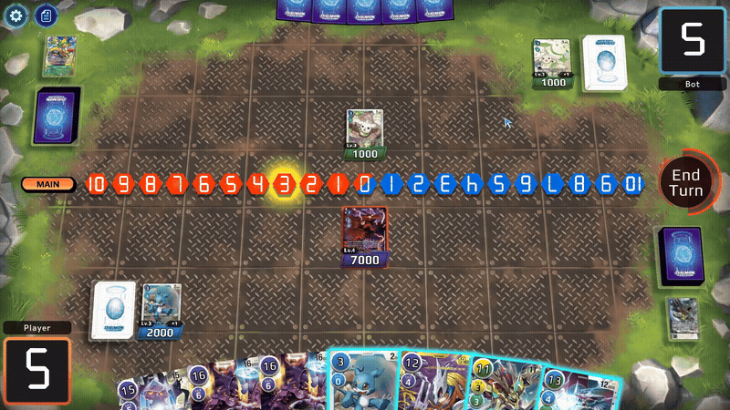

# DCGO-Tweaks

DCGO Tweaks is a visual overhaul mod for DCGO.

- [Installation](#-installation)
- [Features](#-features)
- [Building From Source](#-building-from-source)

---

## Installation
1. Download the latest release of [Melon Loader](https://github.com/LavaGang/MelonLoader/releases).
2. Run the Melon Loader Installer.
3. Add `DCGO.exe` using the "Add Game Manually" button. (Make sure you are adding `Game/DCGO.exe` and NOT `DCGO_Launcher.exe`)
4. Select DCGO from the games list.
5. DCGO requires Melon Loader verion `0.7.2` or later. (You may need to enable nightly builds for `0.7.2` to appear in the list)
6. Hit the install button.
7. [Download the latest release of the mod](https://github.com/BennAbbot/DCGO-Tweaks/releases).
8. Extract files into the folder that contains `DCGO_Launcher.exe`.
9. Launch the game. (The first boot might take some time)

Settings can be changed in `UserData/DCGOTweaks.cfg`

---

## Features
- **Updated UI** — Updated UI assets and layout to make the game look nicer and support more customizability.
  
- **Background Overhaul** — Replaced the game board and background with a single image. At the beginning of a match a random background from `Assets\Textures\Backgrounds` will be selected.
  
- **Zone Info Hiding / Showing** — Deck/Trash/Hand counts are hidden by default. Hold `MMB` or `Left Alt` to toggle there visibility. Each stat's default visibility can be set in `UserData/DCGOTweaks.cfg`
  
- **Curved Hands** — Hands are displayed in a arc.
  
- **Board Collapse** — Automatically compacts unused board space.
  
- **Animated Card Support** — Support for both `.webp` and `.gif` formats for card images. Place images in `Assets\Textures\Card\Animated`.

---

## Building From Source

### Requirements
- Visual Studio 2026
- Some version of Unity
- A modded version of DCGO
- NuGet package: ImageSharp

### Steps
1. Clone repository
2. Open project in VS
3. Right-click the solution
4. Manage NuGet Packages
5. Search for `SixLabors.ImageSharp`
6. Install latest version
7. On line 15 in `DCGO-Tweaks.csproj` update `GamePath` to point to the folder your `DCGO.exe` is in.
8. Build/Run
